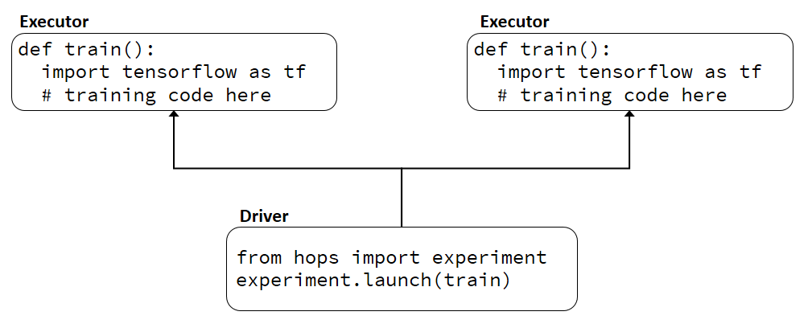
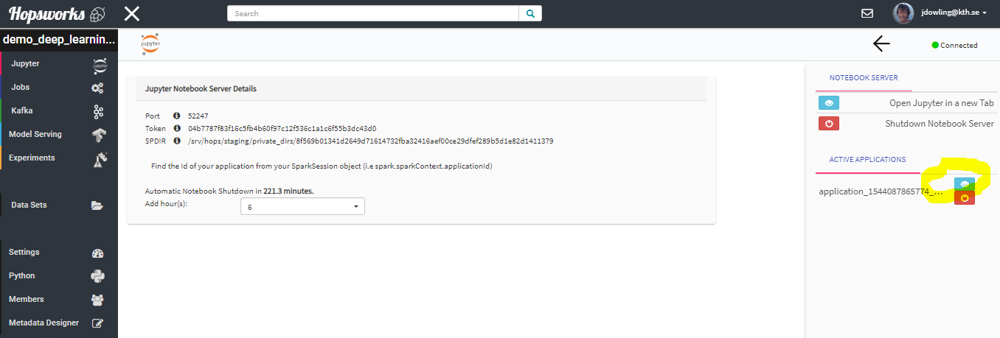
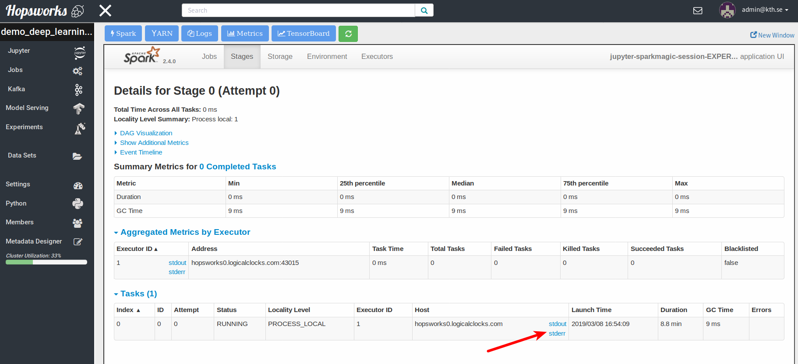
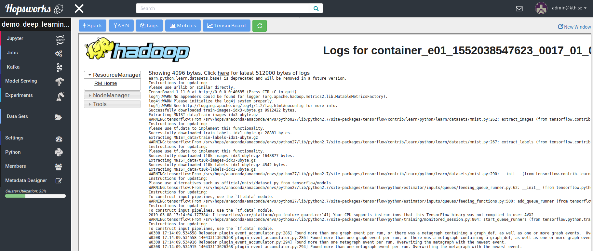
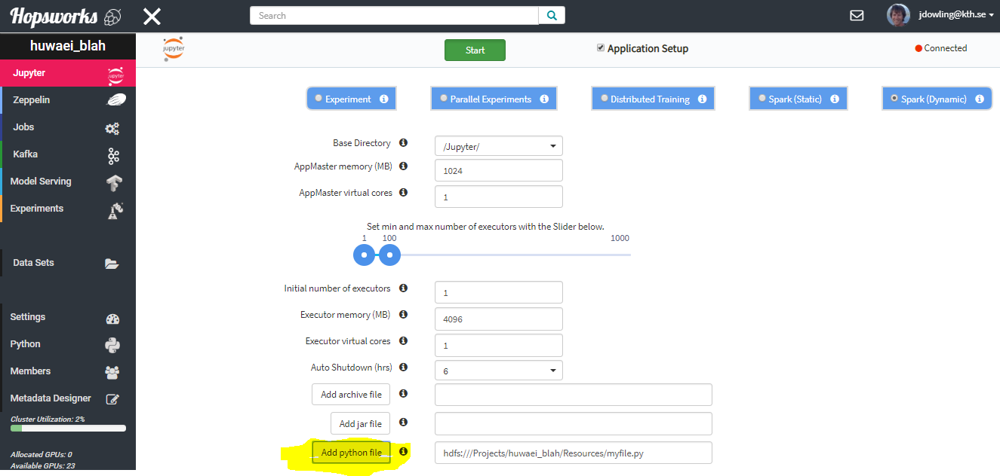

============
hops-util-py
============

`hops-util-py` is a helper library for Hops that facilitates development by hiding the complexity of running applications, discovering services and interacting with HopsFS.

It provides an Experiment API to run Python programs such as TensorFlow, Keras and PyTorch on a Hops Hadoop cluster. A TensorBoard will be started when an Experiment begins and the contents of the logdir saved in your Project.

An Experiment could be a single Python program, which we refer to as an *Experiment*. Grid search or genetic hyperparameter optimization such as differential evolution which runs several Experiments in parallel, which we refer to as *Parallel Experiment*. The library supports ParameterServerStrategy and CollectiveAllReduceStrategy, making multi-machine/multi-gpu training as simple as invoking a function for orchestration. This mode is referred to as *Distributed Training*.

Moreover it provides an easy-to-use API for defining TLS-secured Kafka producers and consumers on the Hopsworks platform as well as an API for interacting with the Hopsworks Feature Store

-----------
Quick Start
-----------

To Install:

>>> pip install hops

Sample usage:

>>> from hops import experiment
>>> from hops import hdfs
>>> notebook = hdfs.project_path() + "Jupyter/Experiment/..." #path to your notebook
>>> # minimal_mnist is a function you defined
>>> experiment.launch(minimal_mnist, #minimal_mnist is your training function
>>>                   name='mnist estimator',
>>>                   description='A minimal mnist example with two hidden layers',
>>>                   versioned_resources=[notebook]

To build docs:

>>> pip install sphinx sphinx-autobuild recommonmark sphinx_rtd_theme jupyter_sphinx_theme hops
>>> cd docs; make html

-------------
Documentation
-------------

An overview of HopsML, a python-first ML pipeline is available here: hopsML_

Example notebooks for doing deep learning and big data processing on Hops are available here: hops-examples_

API documentation is available here: API-docs_

.. _hops-examples: https://github.com/logicalclocks/hops-examples
.. _hopsML: https://hops.readthedocs.io/en/latest/hopsml/hopsML.html
.. _API-docs: http://hops-py.logicalclocks.com/

------------------------------------
Quick Start: Python with HopsML
------------------------------------

Hops uses PySpark to distribute the execution of Python programs in a cluster. PySpark applications consist of two main components, a Driver and one to many Executors. The Driver and the Executors can be started on potentially any host in the cluster and use both the network and the HDFS filesystem to coordinate.

Restructuring Python Programs as PySpark Programs
--------------------------------------------------------------------

If you want to run a Python program, e.g.,  to train a neural network on a GPU on Hops, you will need to restructure your code. The reason for this is that your single Python process needs to be restructured as a PySpark program, see the figure below.

.. _hopsml-pyspark.png: imgs/hopsml-pyspark.png
.. figure:: imgs/hopsml-pyspark.png
    :alt: HopsML Python Program
    :target: `hopsml-pyspark.png`_
    :align: center
    :scale: 75 %
    :figclass: align-center

The good news is that all you will need to do to get started is to move your code inside a function. In the code snippet below, the Executor code is on lines 1-3 (the *train* function) and the Driver code is on lines 5-7. For the Executor, you define a function (e.g., *train*, but the function can have any name).  The code in the function will get run on Executors (containers). To invoke the Executor function (*train*) from the Driver (the main part of your Python program), you use the Experiment API. Launch a single Executor with *experiment.launch(<fn_name>)*.  Launch many Executors with *experiment.grid_search(<fn_name>)* for hyperparameter optimization, and *experiment.collective_all_reduce(<fn_name>)* for distributed training.

.. code-block:: python

  def train():
    import tensorflow as tf
    # training code here

  # Driver code starts here
  from hops import experiment
  experiment.launch(train)

.. _driver.png: imgs/driver.png

Logging in the Driver
---------------------------
When you print to stdout and stderr in the Driver program, the output is printed in the Jupyter console.

.. code-block:: python

   # main scope of program or any non-Executor function
   print('log message is printed to Jupyter cell output')

Logging to stdout/stderr in the Executor
------------------------------------------------------

If you execute print(‘...’) in the executor, it will send the output to stdout and stderr on the executor. This will not be displayed in Jupyter console. You can, however, read output in the executors using the Spark UI. As soon as the Spark application has exited, these logs are cleaned up - they are no longer available.

.. code-block:: python

  train():
    # This will write to stdout/stderr on the Spark Executors
    # You can only view this log entry from the Spark UI while the application
    # is running.
    print("Executor log message - not visible in Jupyter, visible in Spark UI")

To access the Spark executor logs, you will need 4 clicks on your mouse:
1. Select the UI for the application you started running from Jupyter (click on the button inside the yellow highlighter in the image below):

.. _executor-stderr1.png: imgs/executor-stderr1.png

2.  Select the “Executors” tab from the Spark UI (click on the button inside the yellow highlighter):

.. _executor-stderr2.png: imgs/executor-stderr2.png
.. figure:: imgs/executor-stderr2.png
    :alt: Stdout-err-2
    :target: `executor-stderr2.png`_
    :align: center
    :scale: 75 %
    :figclass: align-center

3. Now you should see all the Executors that are running (active) or have finished running more than 90 seconds ago (dead). There will be stdout and stderr logs available for every Executor here - if you ran with 10 GPUs, with 1 GPU per Executor, there will be 10 different stdout and 10 different stderr log files available.. Click on the stderr or stdout log for the Executor you want to examine (yellow highlighted text below):

.. _executor-stderr3.png: imgs/executor-stderr3.png

4. Now you can see the logs for that Executor on the screen:

.. _executor-stderr4.png: imgs/executor-stderr4.png

Logging to file (HDFS) in the Executor or Driver
---------------------------------------------------

You can also write log messages from either an Executor or Driver to the same logfile in HDFS.

.. code-block:: python

  train():
    # This will write to your Experiments/ directory in your project
    from hops import hdfs
    hdfs.log("This is written to the logfile in the Experiments dataset, not output in Jupyter cell.")

You can navigate to the log file created in the Datasets view in Hopsworks for your project, inside the Experiments dataset. The file created will be called “logfile” and if you right-click on it, you can preview its contents to see the first or last 1000 lines in the file. If you have the data-owner role in the project, you will also be allowed to download this file from here.

.. _executor-hdfs-log.png: imgs/executor-hdfs-log.png
.. figure:: imgs/executor-hdfs-log.png
    :alt: hdfs-log
    :target: `executor-hdfs-log.png`_
    :align: center
    :scale: 75 %
    :figclass: align-center

Note that the default log file is the same for all Executors. If many Executors write concurrently to the same file, this may have negative performance implications as Executors may block, waiting for write access to the file. In large-scale experiments, you can configure each Executors to write to its own log file (append a unique ID to the filename).

Installing Python Libraries in Hopsworks
---------------------------------------------

You can use the ‘Conda’ and ‘Pip’ services in Hopsworks to install python libraries. In the ‘Conda’ service, you can change the conda repository by double-clicking on it and entering the URL for a new repo (or ‘default’ for the standard conda repository).

Note: Pillow and matplotlib do not work from conda. Install using “pip”, instead.

Plotting with Sparkmagic in Jupyter
---------------------------------------------

Hopsworks supports both the Python kernel and Sparkmagic kernel. Plotting in the Python kernel is usually handled by libraries such as matplotlib and seaborne. These libraries can also be used in the Sparkmagic kernel, but require more work from the developer, as dataframes in Spark are distributed in the cluster and need to be localized to the Jupyter notebook server as Pandas dataframes, in order to be plotted.
When you run a PySpark program with the Sparkmagic kernel in Jupyter, you will not need to initialize a Spark context, as it is done automatically for you (by Sparkmagic). However, as the PySpark application is not running on the same host as the Jupyter notebook server, plotting (with matplotlib) will not work as normal in a Python kernel. The main change you need to make is to use ‘magics’ in the sparkmagic kernel to get Spark or Pandas dataframes to be localized to the Jupyter notebook server, from where they can be visualized. More details are found in the reference notebook below. Information on the magics available in Sparkmagic are found in the link below.

Adding Python modules to a Jupyter notebook
---------------------------------------------

.. _add-python-module.png: imgs/add-python-module.png

References
--------------

- https://github.com/logicalclocks/hops-examples/blob/master/tensorflow/notebooks/Plotting/data_visualizations.ipynb
- https://github.com/jupyter-incubator/sparkmagic/blob/master/examples/Magics%20in%20IPython%20Kernel.ipynb
